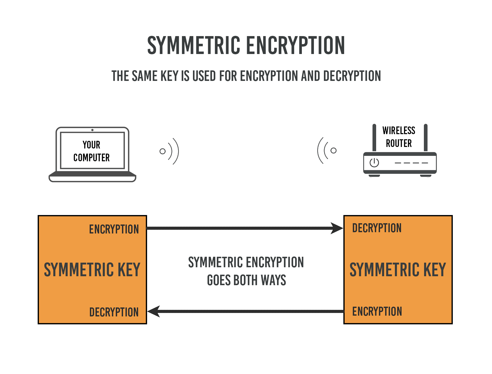
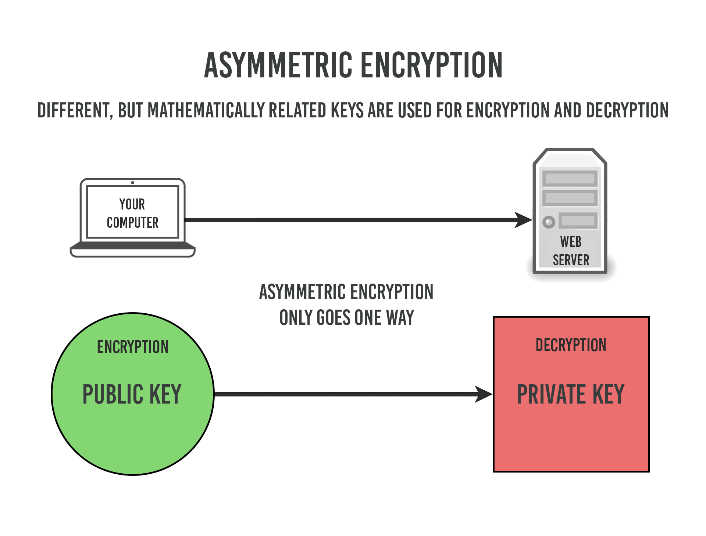

Certificado raiz e autoassinado
===
Este artigo se propõe a ser um estudo dirigido e prático
sobre o uso de certificados SSL, autoassinados e não autoassinados.

Com exemplos praticos usando prompt de comando e pequenas aplicações de exemplo em nodejs.

Neste estudo pretendo compartilhar algumas das coisas que aprendi e peço que me perdoem pela falta de um rigor maior ou algum eventual erro. Sintam-se livres para corregir e ponderar pontos que possam estar errados.

# Conteúdo
 - [Visão Geral](#visao-geral)
 - [Usando openssl](#usando-openssl)
 - [Usando cfssl](#usando-cfssl)
 - [Aplicação Exemplo](#aplicação-exemplo)
 - [Arquivos e Extensões](#arquivos-e-extensoes)
 

# Visão Geral

## Contexto

Há muito tempo a criptografia é usada para proteger informações, em geral escrita, de olhares não desejados.
Já foi e segredo de estado <b>Cifra de César</b> e durante 
a guerra fria, a inteligência inglesa já usava métodos de criptografia assimétrica, antes da sua popularização.

Hoje a criptografia é amplamente usada na internet, através dos certificados digitais, embora haja poucos interessados em sabem como ela funciona.

A criptografia tem como característica ser a conjunção de um método (uma sequencia de passos) de conhecimento relativamente difundido combinada com um segredo (uma variável particular de conhecimento apenas dos pares).

Também pode ser dividida nas suas etapas:
A etapa de cifrar, que é o processo de embaralhar a mensagem com o objetivo de esconder o seu significado, esta etapa é feita pelo emissor.

E o processo de descifrar, que é desembaralhar a mensagem, e é feito pelo receptor da mensagem.

Nenhuma criptografia é indecifrável tecnicamente, mas na prática isto pode ser impossível, ou por inviabilidade econômica, tecnológica em tempo hábil, até que aquela informação ainda seja relevante.

O poder de uma criptografia depende de 2 fatores, a força do seu algorítico (o método de embaralhamento) e o tamanho da sua chave (seu segredo).

## Criptografia Simétrica e Assimétrica


Na criptografia simétrica, tanto o emissor quanto o receptor conhecem o mesmo segredo e o usam tanto para cifrar quanto para descifrar as mensagens, bastando que compartilhem o mesmo método.
Temos aí um problema, o segredo é muito importante. Transportar-lo e mantê-lo confidencial exige uma logística muito grande, e basta uma parte de N falhar para que todo o sistema seja comprometido.

No ambiente de uma grande rede de computadores, seria inviável compartilhar o segredo fisicamente, método que seria o mais seguro. Por exemplo entre um servidor na Alemanha e um no Brasil, e talvez um nos EUA, e por tantos outros que surjam em pontos distantes e queiram se comunicar de maneira segura.
A única maneira viável logisticamente seria enviar o segredo pelo próprio canal de comunicação, sendo esta a primeira mensagem, o que é super inseguro.

Temos aí 2 maneiras: a primeira segura, porém inviável logisticamente, já a segunda é viável logisticamente, mas bem insegura.


E se houvesse uma maneira de combinar só as partes boas de cada método ? E se eu disser que existe ? Então chega a criptografia assimétrica para resolver esta questão, mas ela é um pouquinho mais complicada.

Na criptografia assimétrica existem 2 segredos, um deles usado para cifrar e o outro para descifrar.
São chamados de <b>chave publica</b> e <b>chave privada</b>.



Sendo a chave publica derivada da chave privada, e enquanto a chave públic é distribuida para os emissores que desejam enviar mensagens para este receptor a chave privada se mantem sigilosa e é usado pelo receptor para descifrar as mensagens cifradas pela sua parte pública.

No início da comunicação, os envolvidos distribuem suas chaves públicas para que assim todos possam receber mensagens cifradas através de um canal inseguro.

A chave privada <b>nunca</b> é distribuida, e no caso desta ser comprometida, apenas o dono dela estará comprometido, não o sistema inteiro. 

Além disso, basta regerar o par de chaves, pois no início da próximo comunicação a nova chave pública será distribuida para os outros participantes.


## Certificados digitais

Certificados digitais são uma maneira de distribuir chaves públicas de criptografia para manter o conteúdo das mensagens <b>confidencial</b>.

Garantir a <b>identidade</b> do receptor (ele é quem diz ser) através de uma autoridade certificadora.

E também pode ser usado como forma de <b>autenticação</b> mais segura que passwords.

Garantir a <b>integridade</b> das mensagens recebidas, pois o conte
udo original não pode ser alterado sem que a mensagem seja invalidada.

### X.509
X.509 é um padrão largamente usado para certificados,
Os protocolos SSL e TSL fazem uso dele.
Neste padrão existem uma série de campos, uns opcionais e outros obrigatórios.
 - Nome da Organização
 - País
 - Estado
 - Unidade Empresarial
 - Email
 - domínios
 - usos
 - etc

Não pretendo entrar a fundo aqui, mas existem outros padrões como PGP (e que conheço menos ainda) que é muito usado pelos sistemas de pacotes do linux.

# Usando openssl

### 1) Criar uma chave privada para o seu domínio

```bash
$ openssl genrsa -out exerciciosresolvidos.net.key 2048
```

### 2) Extrair a chave pública da chave privada

```bash
$ openssl rsa -in exerciciosresolvidos.net.key -pubout -out exerciciosresolvidos.public.net.key
```

### 3) Constuir um crs (Certificate sign request), ou seja um pedido para assinatura de certificado,
para isso é fornecida a chave privada (de onde será extraída a chave pública) e diversas informações 
sobre o host etc
```bash
$ openssl req -new -key exerciciosresolvidos.net.key -out exerciciosresolvidos.net.csr
```

### 4) Verificar csr
```bash
$ openssl req -text -in exerciciosresolvidos.net.csr -noout -verify
```

### 5) autoassinar (sem CA)
```bash
$ openssl x509 -req -days 365 -in exerciciosresolvidos.net.csr -signkey exerciciosresolvidos.net.key -out exerciciosresolvidos.net.crt
```

ver o arquivo [openssl.sh](openssl.sh)


# Usando cfssl 
cfssl (cloudfront ssl) é um wrapper para o openssl desenvolvidos pelo cloudFront que simplifica muitas tarefas cotidianas no gerenciamente de certificados, ele também possui uma api http+json.
O cfssl trabalha com inputs em formato json (sua api http recebe exatamente este mesmo input) 
diferente do openssl que trabalha com um formato proprio ou requer interação.

### 1) é necessário ter um arquivo de configuração,
nele já são informados todos os campos necessários ao certificado (names)
bem como a maneira como a chave privada será gerada (key)
e também a duração do mesmo

Então aí estão os <b>3 componentes</b> da chave:
  - informações
  - chave privada
  - expiração

```bash
$ cat > config.json <<EOF
{
   "hosts": [
      "localhost",
      "www.example.com"
   ],
   "CN": "localhost",
   "key": {
      "algo": "rsa",
      "size": 2048
   },
   "names": [
      {
         "C": "BR",
         "L": "Rio de Janeiro",
         "O": "zamba",
         "OU": "exerciciosresolvidos site 1"
      }
   ],
   "ca": {
      "expiry": "262800h"
   }
}
EOF
```

### 2) Com este comando são gerados 3 arquivos.

```bash
cfssl selfsign localhost config.json | cfssljson -bare exerciciosresolvidos
```


Este comando pode ser dividido em 2 partes,
A primeira dá saída em um json com 3 campos (key, cert e csr) e a segundo transforma esta saída em 3 arquivos,

<b>exerciciosresolvidos-ca.pem</b> para o campo <b>key</b>(chave privada)

<b>exerciciosresolviros.csr</b>   para o campo <b>csr</b>

<b>exerciciosresolvidos.pem</b> para o campo <b>cert</b>


# Aplicação exemplo
Adicionar a aplicação nodejs (escolhida aqui simplicidade para ser o mais didático possível)

```javascript
const https = require('https');
const fs = require('fs');

const options = {
  key: fs.readFileSync('exerciciosresolvidos.net.key'),
  cert: fs.readFileSync('exerciciosresolvidos.net.crt'),
};

https.createServer(options, (req, res) => {
  res.writeHead(200);
  res.end('hello world\n');
}).listen(8000);
```

ver o arquivo [https-server.js](https-server.js)


# Arquivos e extensões

## sinopse


### formato <b>PEM</b>
  - São arquivos ACII codificados Base64
  - Eles possuem extensões como .pem, .crt, .cer, .key
  - Servidores Apache e similares usam certificados de formato PEM

### formato <b>DER</b>
  - São arquivos em formato binário
  - Eles possuem extensões .cer & .der
  - DER normalmente é usado na plataforma Java

# Referências

https://www.digicert.com/ssl-support/openssl-quick-reference-guide.htm

https://ajudadoprogramador.com.br/artigo/certificado-auto-assinado-no-linux

https://github.com/cloudflare/cfssl/wiki/Creating-a-new-CSR

https://www.sitepoint.com/how-to-use-ssltls-with-node-js/

https://gist.github.com/Soarez/9688998


Sobre ca-bundle (pacote de certificados)
https://www.namecheap.com/support/knowledgebase/article.aspx/986/69/what-is-ca-bundle